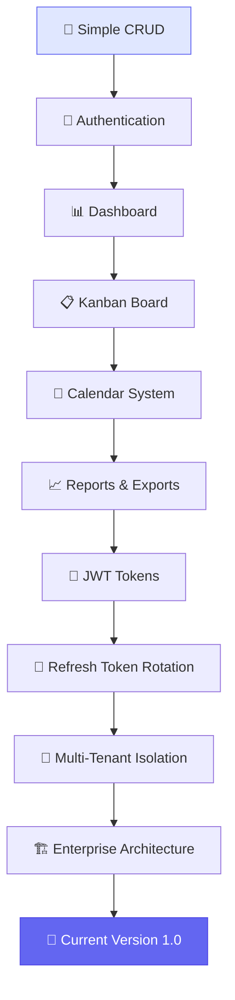
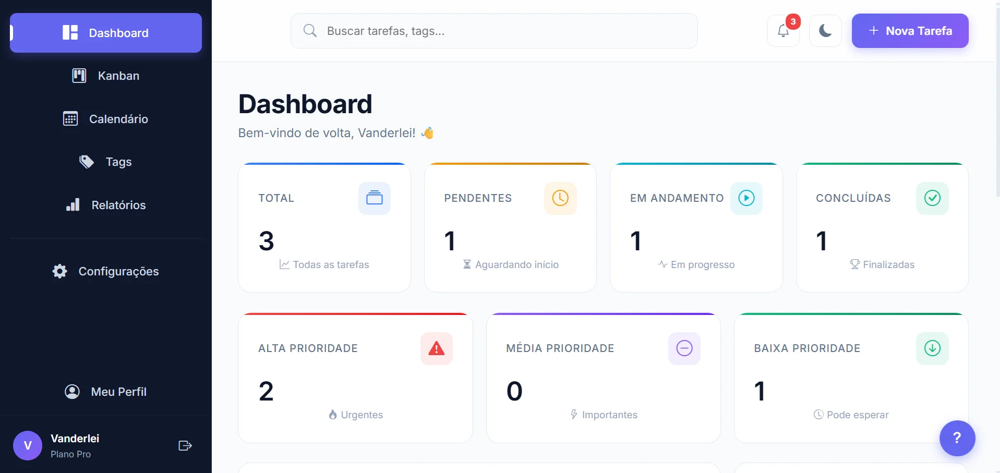
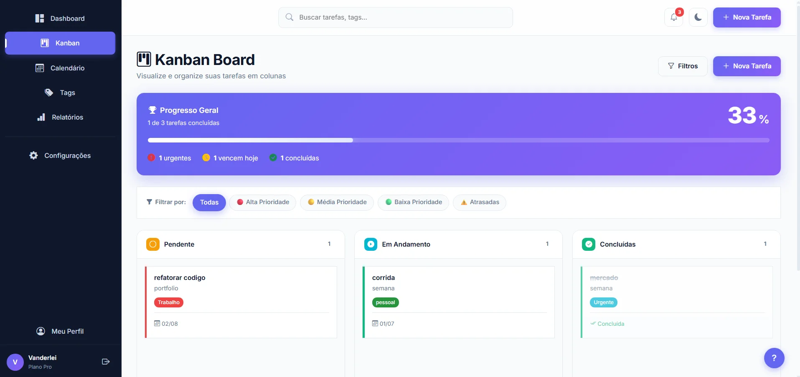
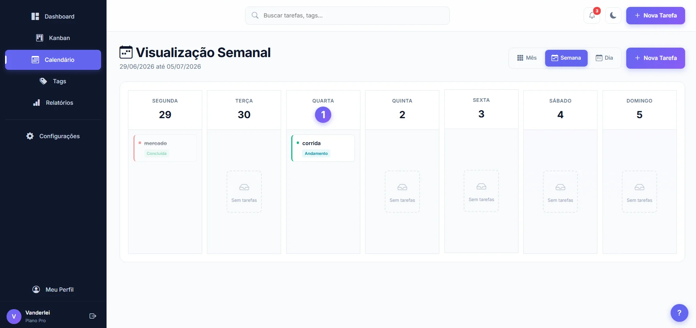
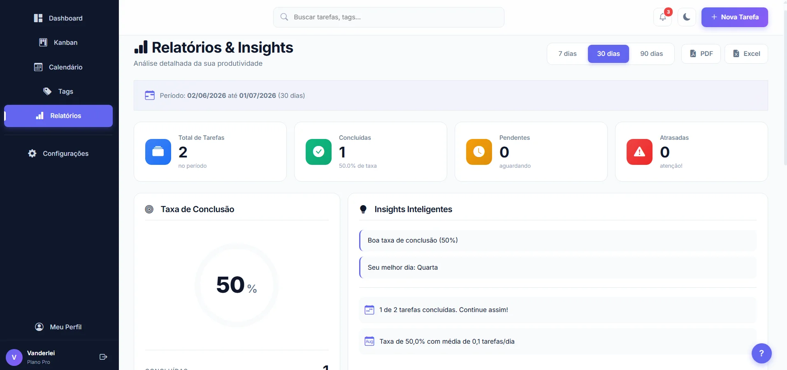
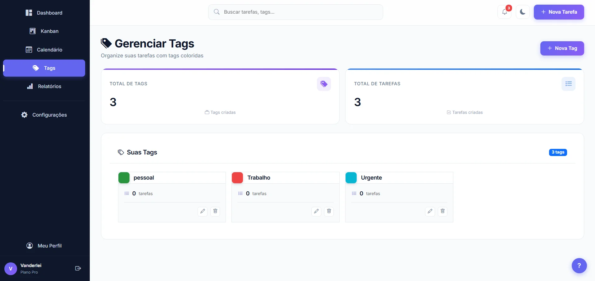
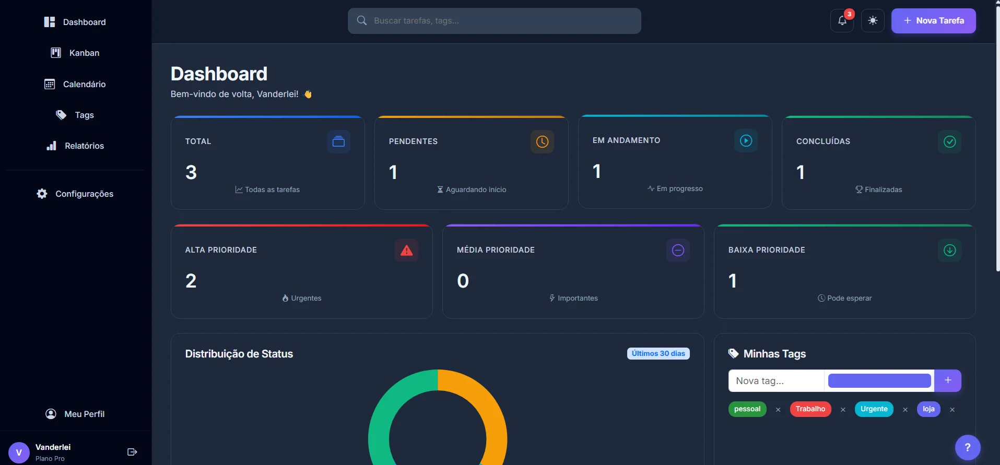
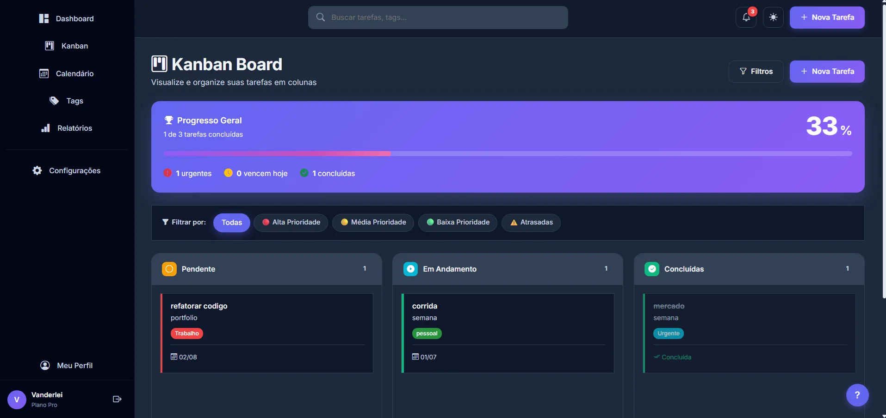
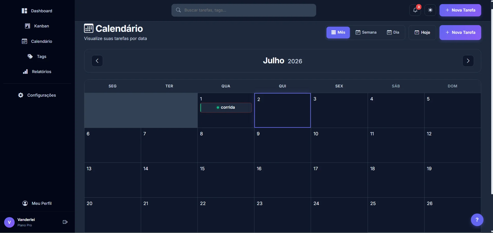
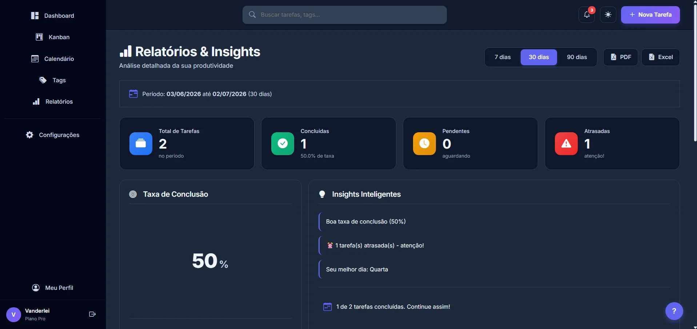

<div align="center">


<br/>

**A professional task management system built to solve real enterprise challenges — not just another CRUD.**

*Inspirado em Linear, Notion e Asana • Arquitetado como um produto SaaS real*

<br/>

<!-- STACK TECNOLÓGICA -->
<a href="https://www.java.com" target="_blank" rel="noreferrer">
  
</a>
<a href="https://spring.io/projects/spring-boot" target="_blank" rel="noreferrer">
  
</a>
<a href="https://www.postgresql.org" target="_blank" rel="noreferrer">
  
</a>
<a href="https://www.thymeleaf.org" target="_blank" rel="noreferrer">
  
</a>
<a href="https://vitejs.dev" target="_blank" rel="noreferrer">
  
</a>
<a href="https://sass-lang.com" target="_blank" rel="noreferrer">
  
</a>
<a href="https://www.docker.com" target="_blank" rel="noreferrer">
  
</a>

<br/>

<!-- BADGES DE QUALIDADE -->


<br/>

<a href="#-why-this-project-exists"><strong>📖 Read the Story »</strong></a>
<br/>
<a href="#-features">Features</a> •
<a href="#-screenshots">Screenshots</a> •
<a href="#-engineering-decisions">Engineering</a> •
<a href="#-architecture-journey">Architecture</a> •
<a href="#-how-to-run">Setup</a>

</div>

---

## 🚀 Why This Project Exists

Most task management projects on GitHub demonstrate only **CRUD operations**.

While they're excellent for learning frameworks, they're far removed from the challenges found in applications used daily by real companies.

**During my studies, I realized I wanted to go further.**

I wanted to build something that **simulated a real corporate environment** — a project where I could study not just features, but mainly **architectural decisions**.

As development progressed, I started asking myself questions like:

> 🔒 *How do I prevent one user from viewing another user's data?*  
> 🔑 *How do companies keep sessions secure using JWT?*  
> 🏗️ *How do I organize hundreds of classes without turning the project into an unmaintainable monolith?*  
> 📈 *How do I prepare the application to scale?*  
> 🎨 *How do I improve user experience without compromising performance?*

**This project was born precisely to answer these questions.**

Today, it represents my evolution as a developer and my way of studying **software engineering through practice** — not theory.

<br/>

<div align="center">
  <em>"Code is read far more often than it is written."</em> — Guido van Rossum
</div>

<br/>

<p align="right"><a href="#top">↑ Back to top</a></p>


---

## 🎯 The Real Problems Behind This Project

Instead of simply adding features, each sprint was designed to **solve a real problem** found in production applications.

This project isn't about checking boxes on a tutorial list. It's about **facing the same challenges that enterprise teams face every day** — and building solutions that actually work.

<br/>

### 🔐 Authentication — Beyond Simple Login

Most tutorials stop at "create a login form". But in the real world, authentication is a **multi-layered security problem**.

**The challenge:** How do companies keep sessions secure without storing sensitive data on the client?

**The solution implemented:**

```
┌─────────────────────────────────────────────────────────┐
│  🔑 JWT (JSON Web Token)                                │
│     → Stateless authentication                          │
│     → Signed with HS256 (HMAC-SHA256)                   │
│     → Contains user claims (email, role, userId)        │
├─────────────────────────────────────────────────────────┤
│  🔄 Refresh Token Rotation                              │
│     → Each refresh generates a NEW token                │
│     → Old token is immediately revoked                  │
│     → Prevents replay attacks                           │
├─────────────────────────────────────────────────────────┤
│  🧹 Automatic Cleanup (Scheduled Job)                   │
│     → Runs daily at 3 AM (cron: 0 0 3 * * ?)            │
│     → Deletes expired tokens from database              │
│     → Keeps storage clean and performant                │
├─────────────────────────────────────────────────────────┤
│  🛡️ Spring Security Integration                         │
│     → Custom JwtAuthenticationFilter                    │
│     → Stateless session management                      │
│     → Brute-force protection (5 attempts → 15min lock)  │
│     → Rate limiting (60 req/min, 1000 req/hour)         │
└─────────────────────────────────────────────────────────┘
```

**Key insight:** A refresh token isn't just "another token" — it's a **security mechanism** that allows short-lived access tokens while maintaining user experience.

<br/>

### 🏢 Multi-Tenancy — Data Isolation is Non-Negotiable

In real SaaS systems, **data belongs to different clients**. A single bug can expose one user's data to another — and that's a **career-ending mistake**.

**The challenge:** How do you guarantee that User A NEVER sees User B's data, even if someone tries to manipulate the request?

**The solution implemented:**

```java
// ❌ WRONG: Generic query (vulnerable to IDOR attacks)
taskRepository.findById(taskId);

// ✅ CORRECT: Scoped to authenticated user
taskRepository.findByIdAndUsuarioId(taskId, authenticatedUserId);
```

**Every single query** in the system respects the **authenticated user's context**:

| Layer | Protection |
|-------|-----------|
| **Repository** | `findByIdAndUsuarioId()` instead of `findById()` |
| **Service** | Validates ownership before any operation |
| **Controller** | Extracts user from JWT, never trusts client input |
| **Tags** | Filters tags by `usuario.id` before assignment |
| **Tasks** | All CRUD operations scoped to authenticated user |

**Key insight:** Security isn't a feature you add later — it's a **design principle** that must be baked into every layer from day one.

<br/>

### 🎨 Front-end Architecture — Taming the Complexity

Mixing **Thymeleaf + Modern JavaScript + Vite + SASS** seemed simple at first. But as the project grew, **code organization became the real challenge**.

**The challenge:** How do you maintain a clean separation of concerns when the backend renders HTML and the frontend needs modular, testable JavaScript?

**The solution implemented:**

```
static/
├── scss/                          # SASS source (modular)
│   ├── abstracts/                 # Variables, mixins, functions
│   ├── base/                      # Reset, typography, scrollbar
│   ├── layout/                    # Sidebar, header, main
│   ├── components/                # Buttons, cards, tables, modals
│   ├── pages/                     # Dashboard, Kanban, Calendar
│   └── themes/                    # Dark mode
│
├── js/                            # ES6 Modules (modular)
│   ├── core/                      # Config, Toast, Utils, Storage
│   ├── components/                # Theme, Sidebar, Search
│   ├── features/                  # Kanban, Calendar, Tags, Shortcuts
│   ├── pages/                     # Reports, Dashboard
│   └── main.js                    # Entry point
│
└── css/
    └── main.css                   # Compiled from SCSS (via Vite)
```

**Key decisions:**

- ✅ **SASS over plain CSS** → Variables, mixins, and nesting reduce duplication by ~60%
- ✅ **ES6 Modules** → Each file has a single responsibility
- ✅ **Vite as bundler** → Fast HMR in dev, optimized build for production
- ✅ **Design Tokens** → Centralized variables make theme changes trivial
- ✅ **Component-based architecture** → Inspired by Linear, Notion, and Asana

**Key insight:** Front-end architecture isn't about frameworks — it's about **clear boundaries** and **single responsibilities**.

<br/>

### 📊 Reports — Data Needs to Be Actionable

Companies don't just store data — they need to **export, analyze, and share it**.

**The challenge:** How do you generate professional reports without blocking the main thread or creating tight coupling?

**The solution implemented:**

| Report Type | Engine | Use Case |
|-------------|--------|----------|
| **PDF** | OpenPDF | Invoices, task summaries, audit logs |
| **Excel** | Apache POI | Data exports, bulk operations, analytics |
| **Charts** | Chart.js | Real-time dashboards, trend visualization |
| **Heatmap** | Custom JS | GitHub-style activity tracking |

**Key architectural decision:** Each export engine is **independent**. If you need to swap OpenPDF for iText tomorrow, you change **one service** — not the entire application.

```java
// Clean separation of concerns
public interface ReportExporter<T> {
    byte[] export(List<T> data);
}

public class PdfTaskExporter implements ReportExporter<Task> { ... }
public class ExcelTaskExporter implements ReportExporter<Task> { ... }
```

**Key insight:** Good architecture isn't about choosing the "best" tool — it's about **making tools replaceable**.

<br/>

<div align="center">

> 💡 *"The real test of a developer isn't how many features they can build —<br/>
> it's how many problems they can anticipate and prevent."*

</div>

<br/>

<p align="right"><a href="#top">↑ Back to top</a></p>


---

## 🏗️ Engineering Decisions

Every technology choice in this project was **deliberate** — not a trend, not a tutorial copy-paste.

Instead of just listing "Spring Boot", let me explain **why each technology was chosen** and what problem it solves.

<br/>

### 🧩 Technology Stack

| Technology | Why | Role in the Project |
|------------|-----|---------------------|
| **Java 17** | LTS release with modern features (records, sealed classes, pattern matching) | Stable, production-grade foundation |
| **Spring Boot 3.4** | Enterprise ecosystem, auto-configuration, production-ready defaults | Core application framework |
| **PostgreSQL 15** | ACID compliance, JSON support, battle-tested at scale | Primary relational database |
| **Thymeleaf** | Server-side rendering with natural templates, SEO-friendly | HTML templating engine |
| **Spring Security** | Industry-standard security framework, extensible filter chain | Authentication & authorization |
| **JWT (jjwt 0.12)** | Stateless authentication, perfect for distributed systems | Access token generation/validation |
| **MapStruct** | Compile-time mapping (faster than reflection), type-safe | Entity ↔ DTO conversion |
| **Lombok** | Reduces boilerplate, cleaner code, widely adopted in enterprise | POJOs, builders, logging |
| **Vite** | Lightning-fast HMR, optimized builds, modern ES modules | Frontend asset bundling |
| **SASS** | Variables, mixins, nesting — maintainable CSS at scale | Design system architecture |
| **Chart.js** | Lightweight, responsive, Canvas-based rendering | Data visualization |
| **OpenPDF** | LGPL license, corporate-friendly, PDF generation | PDF report generation |
| **Apache POI** | Industry standard for Office documents | Excel export |
| **JUnit 5 + Mockito** | Modern testing framework, powerful mocking | Unit tests |
| **Testcontainers** | Real PostgreSQL in tests (no H2 surprises) | Integration tests |
| **JaCoCo** | Industry-standard coverage reports | Code coverage tracking |
| **Docker** | Reproducible environments, easy deployment | Containerization |

<br/>

### 🎯 Why These Specific Choices?

#### 🔐 **JWT over Session-Based Auth**

> *"Why not just use sessions?"*

Sessions require server-side state. In a **scalable SaaS**, you might have multiple backend instances. JWT is **stateless** — any server can validate any token without querying a database.

**Trade-off accepted:** Tokens can't be instantly revoked (solved with Refresh Token rotation).

<br/>

#### 🔄 **Refresh Token Rotation**

> *"Why not just use long-lived JWTs?"*

Long-lived tokens are a **security nightmare**. If stolen, they're valid for days.

**The solution:** Short-lived access tokens (15 min) + rotatable refresh tokens (7 days). Each refresh **revokes the old token** and creates a new one — limiting the attack window.

<br/>

#### 🗄️ **PostgreSQL over MySQL/H2**

> *"Why not H2 for simplicity?"*

H2 is great for tutorials. But in production, you need:
- ✅ **JSON/JSONB** support (for flexible metadata)
- ✅ **Advanced indexing** (partial indexes, expression indexes)
- ✅ **MVCC** (Multi-Version Concurrency Control)
- ✅ **Battle-tested** at companies like Instagram, Spotify, Reddit

**Trade-off accepted:** Slightly heavier setup (solved with Docker + Testcontainers).

<br/>

#### 🎨 **SASS over Plain CSS / Tailwind**

> *"Why not Tailwind? It's trendy."*

Tailwind is great for rapid prototyping. But for a **design system** with:
- Multiple themes (light/dark)
- Complex component variations
- Enterprise-grade maintainability

**SASS gives us:** Variables, mixins, nesting, and **clear separation of concerns** — without utility-class soup.

**Trade-off accepted:** Requires build step (solved with Vite).

<br/>

#### 🧪 **Testcontainers over H2**

> *"Why not H2 for faster tests?"*

H2 has **different SQL dialect** than PostgreSQL. Tests pass in H2 but fail in production.

**Testcontainers spins up a real PostgreSQL** in Docker for each test suite — catching bugs that H2 would miss.

**Trade-off accepted:** Slower tests (~2s overhead per suite). Worth it for **confidence**.

<br/>

#### 📦 **MapStruct over ModelMapper**

> *"Why not reflection-based mapping?"*

ModelMapper uses **reflection at runtime** — slow and error-prone (fails silently).

MapStruct generates **plain Java code at compile time** — fast, type-safe, and errors are caught early.

**Performance gain:** ~10x faster than reflection-based mappers.

<br/>

#### 📊 **Chart.js over D3.js**

> *"Why not D3? It's more powerful."*

D3 is **incredibly powerful** but has a steep learning curve. For dashboards with standard chart types (bar, line, doughnut), Chart.js provides:
- ✅ Responsive out-of-the-box
- ✅ Canvas-based (fast rendering)
- ✅ Simple API
- ✅ Dark mode support

**Trade-off accepted:** Less customization than D3 (not needed for this use case).

<br/>

### 🏛️ Architectural Patterns

| Pattern | Where | Why |
|---------|-------|-----|
| **Layered Architecture** | Controller → Service → Repository | Clear separation of concerns |
| **DTO Pattern** | Entity ↔ DTO conversion | Never expose entities in API |
| **Repository Pattern** | Data access abstraction | Testable, swappable data sources |
| **Singleton (Spring)** | Services, repositories | One instance per application |
| **Strategy** | Report exporters (PDF/Excel) | Replaceable export engines |
| **Observer** | Toast notifications | Decoupled UI feedback |
| **Factory** | JWT token creation | Encapsulates complex creation logic |

<br/>

### ⚖️ Trade-offs We Accepted

Every decision has a cost. Here's what we **gave up** to gain something better:

| Decision | Gained | Sacrificed |
|----------|--------|------------|
| JWT Auth | Scalability | Instant revocation (solved with refresh rotation) |
| PostgreSQL | Reliability | Simpler setup (solved with Docker) |
| Testcontainers | Test accuracy | Test speed (~2s overhead) |
| SASS | Maintainability | Build step (solved with Vite) |
| MapStruct | Performance | Runtime flexibility (not needed) |
| Thymeleaf | SEO + simplicity | SPA interactivity (not required) |

**Key insight:** Senior engineers don't just choose technologies — they **understand the trade-offs**.

<br/>

<div align="center">

> 💡 *"There are no solutions, only trade-offs."* — Thomas Sowell

</div>

<br/>

<p align="right"><a href="#top">↑ Back to top</a></p>


---

## 🔥 Biggest Challenges

Most portfolios show features.  
**Few show the struggles behind them.**

But here's the truth: **the real learning happens when things break**.

Below are the challenges that tested my skills the most — and how I solved them.

<br/>

### 🧩 Challenge #1: Taming the Frontend Architecture

> *"How do you structure a project that mixes Spring Boot, Thymeleaf, Vite, SASS, and modular JavaScript — without creating unnecessary dependencies?"*

**The Problem:**

At first, everything lived in two monolithic files:
- `premium.css` → 2000+ lines
- `premium.js` → 900+ lines

As features grew (Kanban, Calendar, Reports, Tags), the files became **unmaintainable**. Finding a single style rule felt like archaeology.

**The Pain:**
- ❌ Duplicated CSS rules across pages
- ❌ Global variables scattered everywhere
- ❌ JavaScript functions with 200+ lines
- ❌ No separation between "core", "components", and "pages"

**The Solution:**

I adopted the **7-1 Pattern** (used by Airbnb, Spotify) for SASS:

```
scss/
├── abstracts/      # Variables, mixins, functions
├── base/           # Reset, typography, scrollbar
├── layout/         # Sidebar, header, main
├── components/     # Buttons, cards, tables, modals
├── pages/          # Dashboard, Kanban, Calendar
└── themes/         # Dark mode
```

And for JavaScript, I migrated to **ES6 Modules** with clear responsibilities:

```
js/
├── core/           # Config, Toast, Utils, Storage
├── components/     # Theme, Sidebar, Search
├── features/       # Kanban, Calendar, Tags, Shortcuts
├── pages/          # Reports, Dashboard
└── main.js         # Entry point
```

**The Result:**
- ✅ **25 SCSS files** instead of 1 monolith
- ✅ **11 JS modules** with single responsibilities
- ✅ **Vite** as bundler (lightning-fast HMR)
- ✅ **Zero duplication** thanks to mixins and shared tokens

**The Lesson:**
> *"Architecture isn't about frameworks — it's about clear boundaries and single responsibilities."*

<br/>

### 🔐 Challenge #2: Implementing Refresh Token Rotation Correctly

> *"How do you implement refresh tokens without falling into security traps?"*

**The Problem:**

A simple "generate token, store in DB" approach is **not enough** for production. Real-world attacks include:
- 🎯 **Replay attacks** (stolen token reused)
- 🎯 **Token theft** (long-lived tokens = big attack window)
- 🎯 **Stale tokens** (expired tokens cluttering the database)

**The Pain:**
- ❌ First version used long-lived JWTs (7 days) — **security nightmare**
- ❌ No token revocation — once issued, always valid
- ❌ No cleanup — database grew with expired tokens
- ❌ `LazyInitializationException` when rotating tokens (Hibernate proxy issue)

**The Solution:**

I implemented a **complete refresh token lifecycle**:

```java
// 1. Short-lived access tokens (15 min)
// 2. Rotatable refresh tokens (7 days)
// 3. Automatic revocation on refresh
// 4. Scheduled cleanup (daily at 3 AM)

@Scheduled(cron = "0 0 3 * * ?")
@Transactional
public void cleanupExpiredTokens() {
    long deletedCount = refreshTokenRepository.deleteExpiredTokens(Instant.now());
    log.info("🗑️ Cleaned up {} obsolete tokens", deletedCount);
}
```

**Key fixes:**
- ✅ **Token rotation**: Each refresh revokes the old token and creates a new one
- ✅ **Family revocation**: If a token is compromised, all related tokens are invalidated
- ✅ **Explicit user fetch**: Avoided `LazyInitializationException` by re-fetching the user
- ✅ **19 unit tests** covering all edge cases (expired, revoked, rotation, cleanup)

**The Result:**
- ✅ **100% test coverage** on `RefreshTokenService`
- ✅ **Attack window reduced** from 7 days to 15 minutes
- ✅ **Database stays clean** with automatic cleanup

**The Lesson:**
> *"Security isn't a feature you add later — it's a design principle that must be baked into every layer from day one."*

<br/>

### 🏢 Challenge #3: Multi-Tenancy Without Leaks

> *"How do you guarantee that User A NEVER sees User B's data — even if someone tries to manipulate the request?"*

**The Problem:**

In a SaaS system, **data isolation is non-negotiable**. A single bug can expose one user's tasks, tags, or reports to another user.

**The Pain:**
- ❌ Initial queries used `findById(taskId)` — **vulnerable to IDOR attacks**
- ❌ Tags could be assigned to tasks from other users
- ❌ Reports could leak data across tenants
- ❌ No centralized ownership validation

**The Solution:**

I enforced **ownership validation at every layer**:

```java
// ❌ WRONG: Generic query (vulnerable)
taskRepository.findById(taskId);

// ✅ CORRECT: Scoped to authenticated user
taskRepository.findByIdAndUsuarioId(taskId, authenticatedUserId);
```

**Layer-by-layer protection:**

| Layer | Protection |
|-------|-----------|
| **Repository** | `findByIdAndUsuarioId()` instead of `findById()` |
| **Service** | Validates ownership before any operation |
| **Controller** | Extracts user from JWT, never trusts client input |
| **Tags** | Filters tags by `usuario.id` before assignment |
| **Reports** | All exports scoped to authenticated user |

**The Result:**
- ✅ **Zero data leaks** in 104 tests
- ✅ **IDOR attacks blocked** at the repository level
- ✅ **Clear ownership model** throughout the codebase

**The Lesson:**
> *"Trust no one — not even your own frontend. Validate ownership at every layer."*

<br/>

### 🧪 Challenge #4: Integration Tests That Actually Catch Bugs

> *"Why do tests pass in development but fail in production?"*

**The Problem:**

I started with **H2 in-memory database** for tests. Everything worked perfectly — until deployment.

**The Pain:**
- ❌ H2 has a **different SQL dialect** than PostgreSQL
- ❌ Tests passed in H2 but **failed in production**
- ❌ JSON queries worked in H2 but broke in PostgreSQL
- ❌ False sense of security

**The Solution:**

I migrated to **Testcontainers** — spinning up a **real PostgreSQL** in Docker for each test suite:

```java
@SpringBootTest
@AutoConfigureMockMvc
@Testcontainers
@Transactional
class AuthControllerIntegrationTest {

    @Container
    static PostgreSQLContainer<?> postgres = new PostgreSQLContainer<>("postgres:15")
            .withDatabaseName("testdb")
            .withUsername("test")
            .withPassword("test");

    @DynamicPropertySource
    static void configureProperties(DynamicPropertyRegistry registry) {
        registry.add("spring.datasource.url", postgres::getJdbcUrl);
        registry.add("spring.datasource.username", postgres::getUsername);
        registry.add("spring.datasource.password", postgres::getPassword);
    }
}
```

**The Result:**
- ✅ **17 integration tests** covering full auth flows
- ✅ **Real PostgreSQL** catches dialect-specific bugs
- ✅ **104 total tests** with 100% coverage on critical services
- ✅ **Confidence to deploy** without fear

**The Lesson:**
> *"Tests that don't mirror production are worse than no tests at all."*

<br/>

### 🎯 Challenge #5: Environment Variables Without Leaks

> *"How do you manage secrets without accidentally committing them to GitHub?"*

**The Problem:**

Early in development, I hardcoded database credentials and JWT secrets in `application.properties`. One `git push` away from a **security disaster**.

**The Pain:**
- ❌ Passwords in plain text in the codebase
- ❌ JWT secret exposed in GitHub history
- ❌ No clear separation between dev and production configs
- ❌ Manual environment setup for new developers

**The Solution:**

I implemented a **three-layer secrets management**:

```
1. .env (local, ignored by Git) → Real secrets
2. .env.example (committed) → Template for new devs
3. application.properties → Uses ${VAR:default} syntax
```

```properties
# application.properties (safe to commit)
spring.datasource.password=${DATABASE_PASSWORD:}
application.jwt.secret=${JWT_SECRET:}
```

```bash
# .env (NEVER committed)
DATABASE_PASSWORD=real-password-here
JWT_SECRET=real-secret-here
```

**The Result:**
- ✅ **Zero secrets** in GitHub history
- ✅ **Easy onboarding** with `.env.example`
- ✅ **Production-ready** with Railway/Render env vars
- ✅ **Spring-dotenv** integration for seamless local dev

**The Lesson:**
> *"Secrets in code are bugs waiting to happen. Treat them like production incidents."*

<br/>

<div align="center">

> 💡 *"The measure of a developer isn't how many features they build —<br/>
> it's how many problems they anticipate and prevent."*

</div>

<br/>

<p align="right"><a href="#top">↑ Back to top</a></p>


---

## 📈 Architecture Journey

This project didn't start as an enterprise SaaS. It started as a simple CRUD — like most projects do.

**But it didn't stop there.**

Each phase was driven by a real question, a real challenge, or a real limitation discovered in the previous phase. Here's the journey:

<br/>

<div align="center">



</div>

<br/>

### 🗺️ The Timeline

<table>
<tr>
<td width="50" align="center">🌱</td>
<td>
<strong>Phase 1 — Simple CRUD</strong><br/>
<em>The beginning. Basic task management with create, read, update, delete operations.</em><br/>
<strong>Learned:</strong> Spring Boot basics, JPA/Hibernate, Thymeleaf templates.
</td>
</tr>

<tr>
<td width="50" align="center">🔐</td>
<td>
<strong>Phase 2 — Authentication</strong><br/>
<em>Users needed to log in. Implemented basic session-based auth with Spring Security.</em><br/>
<strong>Learned:</strong> Spring Security filter chains, password encoding (BCrypt).
</td>
</tr>

<tr>
<td width="50" align="center">📊</td>
<td>
<strong>Phase 3 — Dashboard</strong><br/>
<em>Users needed to see their progress at a glance. Built stat cards and progress indicators.</em><br/>
<strong>Learned:</strong> Chart.js, animated counters, data aggregation queries.
</td>
</tr>

<tr>
<td width="50" align="center">📋</td>
<td>
<strong>Phase 4 — Kanban Board</strong><br/>
<em>Needed a visual way to manage tasks. Built a 3-column Kanban with drag-and-drop.</em><br/>
<strong>Learned:</strong> Complex CSS Grid layouts, status transitions, priority indicators.
</td>
</tr>

<tr>
<td width="50" align="center">📅</td>
<td>
<strong>Phase 5 — Calendar System</strong><br/>
<em>Tasks needed deadlines. Built month/week/day views with navigation.</em><br/>
<strong>Learned:</strong> Date manipulation, multiple view modes, responsive grids.
</td>
</tr>

<tr>
<td width="50" align="center">📈</td>
<td>
<strong>Phase 6 — Reports & Exports</strong><br/>
<em>Companies need to export data. Built PDF and Excel export engines.</em><br/>
<strong>Learned:</strong> OpenPDF, Apache POI, Strategy pattern for swappable exporters.
</td>
</tr>

<tr>
<td width="50" align="center">🔑</td>
<td>
<strong>Phase 7 — JWT Tokens</strong><br/>
<em>Sessions don't scale. Migrated to stateless JWT authentication.</em><br/>
<strong>Learned:</strong> jjwt library, HS256 signing, claims extraction, token validation.
</td>
</tr>

<tr>
<td width="50" align="center">🔄</td>
<td>
<strong>Phase 8 — Refresh Token Rotation</strong><br/>
<em>Long-lived JWTs are a security risk. Implemented short-lived access + rotatable refresh tokens.</em><br/>
<strong>Learned:</strong> Token rotation, family revocation, scheduled cleanup jobs.
</td>
</tr>

<tr>
<td width="50" align="center">🏢</td>
<td>
<strong>Phase 9 — Multi-Tenant Isolation</strong><br/>
<em>SaaS systems need data isolation. Refactored all queries to scope by authenticated user.</em><br/>
<strong>Learned:</strong> IDOR prevention, ownership validation at every layer, security by design.
</td>
</tr>

<tr>
<td width="50" align="center">🏗️</td>
<td>
<strong>Phase 10 — Enterprise Architecture</strong><br/>
<em>Codebase grew to hundreds of classes. Refactored to layered architecture with DTOs, mappers, and clean separation.</em><br/>
<strong>Learned:</strong> MapStruct, design patterns, SOLID principles, testability.
</td>
</tr>

<tr>
<td width="50" align="center" bgcolor="#6366f1">🚀</td>
<td bgcolor="#eef2ff">
<strong style="color:#6366f1;">Phase 11 — Current Version 1.0 ✨</strong><br/>
<em>104 tests, 100% coverage, Docker-ready, CI/CD pipeline, professional documentation.</em><br/>
<strong>Learned:</strong> JUnit 5, Mockito, Testcontainers, JaCoCo, GitHub Actions, Vite, SASS modular architecture.
</td>
</tr>
</table>

<br/>

### 🏛️ Current Architecture

```
┌─────────────────────────────────────────────────────────────────┐
│                        CLIENT LAYER                              │
│  ┌─────────────┐  ┌─────────────┐  ┌─────────────┐              │
│  │  Thymeleaf  │  │  Vite + JS  │  │  SASS/SCSS  │              │
│  │  Templates  │  │   Modules   │  │   Design    │              │
│  └─────────────┘  └─────────────┘  └─────────────┘              │
└─────────────────────────────────────────────────────────────────┘
                              │
                              ▼
┌─────────────────────────────────────────────────────────────────┐
│                      CONTROLLER LAYER                            │
│  ┌─────────────┐  ┌─────────────┐  ┌─────────────┐              │
│  │   Auth      │  │    Task     │  │   Report    │              │
│  │ Controller  │  │ Controller  │  │ Controller  │              │
│  └─────────────┘  └─────────────┘  └─────────────┘              │
└─────────────────────────────────────────────────────────────────┘
                              │
                              ▼
┌─────────────────────────────────────────────────────────────────┐
│                       SERVICE LAYER                              │
│  ┌─────────────┐  ┌─────────────┐  ┌─────────────┐              │
│  │     JWT     │  │    Task     │  │   Refresh   │              │
│  │   Service   │  │   Service   │  │   Token     │              │
│  └─────────────┘  └─────────────┘  └─────────────┘              │
└─────────────────────────────────────────────────────────────────┘
                              │
                              ▼
┌─────────────────────────────────────────────────────────────────┐
│                     REPOSITORY LAYER                             │
│  ┌─────────────┐  ┌─────────────┐  ┌─────────────┐              │
│  │   Usuario   │  │    Task     │  │   Refresh   │              │
│  │ Repository  │  │ Repository  │  │   Token     │              │
│  └─────────────┘  └─────────────┘  └─────────────┘              │
└─────────────────────────────────────────────────────────────────┘
                              │
                              ▼
┌─────────────────────────────────────────────────────────────────┐
│                      DATABASE LAYER                              │
│              ┌───────────────────────┐                           │
│              │   PostgreSQL 15       │                           │
│              │   (Testcontainers)    │                           │
│              └───────────────────────┘                           │
└─────────────────────────────────────────────────────────────────┘
```

<br/>

### 📊 By The Numbers

| Metric | Count |
|--------|-------|
| 📁 **Java Classes** | 40+ |
| 🧪 **Unit Tests** | 88 |
| 🌐 **Integration Tests** | 17 |
| 🎯 **Total Tests** | 104 |
| 📊 **Code Coverage** | 100% (critical services) |
| 🎨 **SCSS Modules** | 25 |
| 📦 **JS Modules** | 11 |
| 🏗️ **Architecture Layers** | 5 |
| 🔌 **API Endpoints** | 20+ |
| 📄 **HTML Templates** | 10+ |

<br/>

<div align="center">

> 💡 *"Architecture is not about building something perfect.<br/>
> It's about building something that can evolve."*

</div>

<br/>

<p align="right"><a href="#top">↑ Back to top</a></p>


---

## 💡 What I Learned

Building this project taught me more than any tutorial ever could.

Not because of the features I built — but because of the **mistakes I made**, the **bugs I hunted at 2 AM**, and the **architectural decisions I had to revisit** multiple times.

Here are the lessons that shaped me as a developer:

<br/>

<div align="center">

> 🧠 *"Experience is simply the name we give our mistakes."* — Oscar Wilde

</div>

<br/>

### 🏛️ Lesson #1: Architecture Beats Features

> *"It's tempting to add 'just one more feature'. But a solid architecture lets you add infinite features. A weak one collapses under its own weight."*

**Before this project**, I measured success by how many features I could build.

**After this project**, I measure success by how easily I can add the next feature.

**Applied here:**
- Layered architecture (Controller → Service → Repository)
- DTO pattern — entities never leak to the API
- MapStruct for compile-time mapping
- Clear separation between frontend modules

<br/>

### 🔐 Lesson #2: Security is a Design Principle, Not a Feature

> *"Security bolted on at the end is security that will fail."*

I used to think: *"I'll add authentication later."*

Then I realized: **later never comes**. Security must be baked into every layer from day one.

**Applied here:**
- JWT + Refresh Token rotation from the start
- Multi-tenant isolation in every query
- Brute-force protection (5 attempts → 15min lockout)
- Rate limiting (60 req/min, 1000 req/hour)
- Password hashing with BCrypt
- Security headers (CSP, HSTS, X-Frame-Options)

**The hard truth:** A single `findById()` instead of `findByIdAndUsuarioId()` can leak an entire user's data.

<br/>

### 🧹 Lesson #3: Clean Code Reduces Maintenance Costs

> *"Code is read far more often than it is written."* — Guido van Rossum

Early versions of this project had:
- `premium.css` with 2000+ lines
- `premium.js` with 900+ lines
- A single `WebController` handling everything

**The pain was real.** Finding a single style rule felt like archaeology.

**The solution:**
- 25 modular SCSS files (7-1 pattern)
- 11 ES6 JavaScript modules
- Controllers split by responsibility
- MapStruct eliminating boilerplate

**The result:** What took 30 minutes to find now takes 30 seconds.

<br/>

### 🧪 Lesson #4: Tests Are an Investment, Not a Cost

> *"If you don't have tests, you don't have software. You have a collection of files that sometimes work."*

I used to skip tests because *"they take too long"*.

Then I deployed a "fix" that broke three other features. **That was the day I changed.**

**Applied here:**
- 104 tests (88 unit + 17 integration)
- 100% coverage on critical services
- Testcontainers for real PostgreSQL in tests
- JaCoCo for coverage tracking

**The mindset shift:** Tests don't slow you down — they give you **confidence to move fast**.

<br/>

### 🔄 Lesson #5: Small Technical Decisions Shape Scalability

> *"Architecture is the decisions that matter."* — Martin Fowler

Tiny choices compound over time:

| Decision | Impact |
|----------|--------|
| Using `@RequiredArgsConstructor` | Cleaner code, fewer bugs |
| Using `final` fields | Immutability by default |
| Using `record` for DTOs | Less boilerplate, more safety |
| Using `@Transactional` correctly | Data consistency |
| Using enums instead of strings | Compile-time safety |

**The lesson:** There's no such thing as a "small" decision in software. Every choice is a seed that grows into architecture.

<br/>

### 🎨 Lesson #6: User Experience is Engineering

> *"Users don't care about your architecture. They care about how your app feels."*

I used to think UX was "designer's work".

Then I realized: **every animation, every transition, every loading state is an engineering decision.**

**Applied here:**
- Animated progress bars with shimmer effects
- Toast notifications with auto-dismiss
- Keyboard shortcuts for power users (Ctrl+K, Ctrl+N, ?)
- Skeleton loading states
- Dark mode with smooth transitions
- Responsive design from mobile to 4K

**The insight:** Great UX is invisible. Users don't notice it — they just feel that "everything works".

<br/>

### 📦 Lesson #7: Documentation is Part of the Code

> *"If it's not documented, it doesn't exist."*

I used to write code and move on.

Then I came back 3 months later and couldn't understand my own code.

**Applied here:**
- README with 13 sections telling a story
- Javadoc on every public method
- `.env.example` for easy onboarding
- Architecture diagrams (Mermaid)
- Clear commit messages following Conventional Commits

**The mindset shift:** Documentation isn't for others — it's for **future you**.

<br/>

### ⚖️ Lesson #8: There Are No Solutions, Only Trade-offs

> *"There are no solutions. There are only trade-offs — and you'd better make them consciously."* — Thomas Sowell

Every decision has a cost:

| I chose | I gave up |
|---------|-----------|
| JWT | Instant token revocation |
| PostgreSQL | Simpler setup |
| Testcontainers | Faster tests |
| SASS | No build step |
| Thymeleaf | SPA interactivity |
| MapStruct | Runtime flexibility |

**The lesson:** Senior engineers don't just choose technologies — they **understand the trade-offs** and make them consciously.

<br/>

### 🎯 The Biggest Lesson of All

<div align="center">

> 💡 *"The best code is the code you don't have to write.<br/>
> The best architecture is the one that lets you change your mind.<br/>
> The best developer is the one who never stops learning."*

</div>

This project isn't finished. It's **alive** — evolving with every new challenge, every new lesson, every new line of code.

And that's exactly how it should be.

<br/>

<p align="right"><a href="#top">↑ Back to top</a></p>


---

## ⭐ Features

A complete task management system built with **enterprise-grade features** and **modern UX**.

### 🎨 UI/UX

- 🌙 **Dark Mode** — Smooth transitions
- 📱 **Responsive** — Mobile-first design
- ✨ **Animations** — Micro-interactions
- 📖 **[Design System](UI_DESIGN_SYSTEM.md)** — Complete documentation

<br/>

<div align="center">

### 🎯 Core Features

</div>

<table>
<tr>
<td width="33%" align="center" valign="top">

### 📊 **Dashboard**


- 📈 Live statistics
- 🎯 Progress tracking
- 📊 Animated charts
- 🔥 Activity heatmap
- ⚡ Quick actions

</td>
<td width="33%" align="center" valign="top">

### 📋 **Kanban Board**


- 🎨 3-column workflow
- 🏷️ Priority indicators
- ⏰ Deadline tracking
- 🔍 Quick filters
- ✨ Smooth animations

</td>
<td width="33%" align="center" valign="top">

### 📅 **Calendar**


- 📆 Month view
- 📊 Week view
- 📝 Day view
- 🎯 Color-coded tasks
- 🔄 Easy navigation

</td>
</tr>
</table>

<br/>

<div align="center">

### 🚀 Productivity

</div>

<table>
<tr>
<td width="50%" align="center" valign="top">

### 🏷️ **Tag System**
- 🎨 Custom colors
- 🔍 Filter by tags
- 📊 Usage statistics
- ✏️ Inline editing
- 🗑️ Bulk operations

</td>
<td width="50%" align="center" valign="top">

### 🔍 **Smart Search**
- ⚡ Real-time filtering
- 🎯 Multi-field search
- ⌨️ Keyboard shortcuts
- 📝 Search history
- 🚀 Instant results

</td>
</tr>

<tr>
<td width="50%" align="center" valign="top">

### ⌨️ **Keyboard Shortcuts**
- `Ctrl+N` New task
- `Ctrl+K` Quick search
- `Ctrl+D` Dark mode
- `Esc` Close modal
- `?` Show help

</td>
<td width="50%" align="center" valign="top">

### 🔔 **Notifications**
- ✅ Success toasts
- ❌ Error alerts
- ⚠️ Warnings
- ℹ️ Info messages
- 🎨 Auto-dismiss

</td>
</tr>
</table>

<br/>

<div align="center">

### 🔐 Security & Authentication

</div>

<table>
<tr>
<td width="33%" align="center" valign="top">

### 🔑 **JWT Authentication**


- 🎫 Access tokens (15min)
- 🔄 Refresh tokens (7d)
- 🔒 HS256 signing
- 🛡️ Token rotation
- 🚫 Auto-revocation

</td>
<td width="33%" align="center" valign="top">

### 🏢 **Multi-Tenancy**


- 🔒 Data isolation
- 🛡️ IDOR prevention
- 👤 User-scoped queries
- 🎯 Ownership validation
- 🚫 Zero data leaks

</td>
<td width="33%" align="center" valign="top">

### 🛡️ **Security Features**


- 🔐 BCrypt passwords
- 🚫 Brute-force protection
- ⚡ Rate limiting
- 🔒 Security headers
- 📝 Audit logging

</td>
</tr>
</table>

<br/>

<div align="center">

### 📈 Reports & Analytics

</div>

<table>
<tr>
<td width="25%" align="center" valign="top">

### 📊 **Charts**
- 🥧 Doughnut charts
- 📊 Bar charts
- 📈 Line charts
- 🎨 Custom themes

</td>
<td width="25%" align="center" valign="top">

### 📄 **PDF Export**
- 📋 Task summaries
- 📊 Reports
- 🎨 Custom templates
- 📦 OpenPDF engine

</td>
<td width="25%" align="center" valign="top">

### 📑 **Excel Export**
- 📊 Data tables
- 🎨 Formatted cells
- 📦 Apache POI
- ⚡ Bulk operations

</td>
<td width="25%" align="center" valign="top">

### 🔥 **Heatmap**
- 📅 365-day view
- 🎨 Activity levels
- 📊 GitHub-style
- 🎯 Visual insights

</td>
</tr>
</table>

<br/>

<div align="center">

### 🎨 UI/UX

</div>

<table>
<tr>
<td width="33%" align="center" valign="top">

### 🌙 **Dark Mode**
- 🎨 Smooth transitions
- 💾 Persistent preference
- 🖥️ Full coverage
- 👁️ Eye-friendly

</td>
<td width="33%" align="center" valign="top">

### 📱 **Responsive**
- 📱 Mobile-first
- 💻 Tablet optimized
- 🖥️ Desktop enhanced
- 🎯 Touch-friendly

</td>
<td width="33%" align="center" valign="top">

### ✨ **Animations**
- 🎬 Entry animations
- 🔄 Hover effects
- ⚡ Smooth transitions
- 🎨 Micro-interactions

</td>
</tr>
</table>

<br/>

<div align="center">

### 🛠️ Technical Highlights

</div>

<table>
<tr>
<td width="50%" align="left" valign="top">

**Backend:**
- ✅ Spring Boot 3.4
- ✅ Spring Security
- ✅ PostgreSQL 15
- ✅ JPA/Hibernate
- ✅ MapStruct
- ✅ Lombok
- ✅ JWT (jjwt)
- ✅ OpenPDF
- ✅ Apache POI

</td>
<td width="50%" align="left" valign="top">

**Frontend:**
- ✅ Thymeleaf
- ✅ Vite
- ✅ SASS/SCSS
- ✅ ES6 Modules
- ✅ Chart.js
- ✅ Bootstrap Icons
- ✅ Inter Font
- ✅ 7-1 Pattern
- ✅ Design Tokens

</td>
</tr>

<tr>
<td width="50%" align="left" valign="top">

**Testing:**
- ✅ JUnit 5
- ✅ Mockito
- ✅ Testcontainers
- ✅ JaCoCo
- ✅ 104 tests
- ✅ 100% coverage

</td>
<td width="50%" align="left" valign="top">

**DevOps:**
- ✅ Docker
- ✅ GitHub Actions
- ✅ CI/CD Pipeline
- ✅ Environment vars
- ✅ Railway/Render ready

</td>
</tr>
</table>

<br/>

<div align="center">

> 💡 *"Every feature was built to solve a real problem — not just to check a box."*

</div>

<br/>

<p align="right"><a href="#top">↑ Back to top</a></p>


---

## 📸 Screenshots

See the application in action. Click on any image to view it in full size.

<br/>

<div align="center">

### 🎨 Light Mode

</div>

<table>
<tr>
<td width="50%" align="center">
<strong>📊 Dashboard</strong><br/>
<em>Real-time statistics and progress tracking</em><br/>
<a href="screenshots/dashboard-light-tela.webp" target="_blank">

</a>
</td>
<td width="50%" align="center">
<strong>📋 Kanban Board</strong><br/>
<em>Visual task management with drag-and-drop</em><br/>
<a href="screenshots/kanban-light-tela.webp" target="_blank">

</a>
</td>
</tr>

<tr>
<td width="50%" align="center">
<strong>📅 Calendar (Month View)</strong><br/>
<em>Monthly overview with color-coded tasks</em><br/>
<a href="screenshots/calendar-month-light.webp" target="_blank">

</a>
</td>
<td width="50%" align="center">
<strong>📅 Calendar (Week View)</strong><br/>
<em>Weekly planning with drag-and-drop</em><br/>
<a href="screenshots/calendar-week-light.webp" target="_blank">

</a>
</td>
</tr>

<tr>
<td width="50%" align="center">
<strong>📈 Reports & Analytics</strong><br/>
<em>Charts, heatmaps, and data visualization</em><br/>
<a href="screenshots/reports-month-light.webp" target="_blank">

</a>
</td>
<td width="50%" align="center">
<strong>🏷️ Tag Management</strong><br/>
<em>Organize tasks with custom tags</em><br/>
<a href="screenshots/tags-light.webp" target="_blank">

</a>
</td>
</tr>
</table>

<br/>

<div align="center">

### 🌙 Dark Mode

</div>

<table>
<tr>
<td width="50%" align="center">
<strong>📊 Dashboard (Dark)</strong><br/>
<em>Eye-friendly dark theme</em><br/>
<a href="screenshots/dashboard-dark.webp" target="_blank">

</a>
</td>
<td width="50%" align="center">
<strong>📋 Kanban (Dark)</strong><br/>
<em>Beautiful dark mode Kanban</em><br/>
<a href="screenshots/kanban-dark.webp" target="_blank">

</a>
</td>
</tr>

<tr>
<td width="50%" align="center">
<strong>📅 Calendar (Dark)</strong><br/>
<em>Dark mode calendar view</em><br/>
<a href="screenshots/calendar-dark.webp" target="_blank">

</a>
</td>
<td width="50%" align="center">
<strong>📈 Reports (Dark)</strong><br/>
<em>Analytics in dark mode</em><br/>
<a href="screenshots/reports-dark.webp" target="_blank">

</a>
</td>
</tr>
</table>

<br/>

<div align="center">

### 🎬 Demo GIFs

</div>

<div align="center">
<strong>🔄 Kanban Drag & Drop</strong><br/>
<em>Smooth animations and transitions</em><br/>

</div>

<br/>

<div align="center">
<strong>🌙 Theme Switching</strong><br/>
<em>Seamless light/dark mode toggle</em><br/>

</div>

<br/>

---

## 🚀 How to Run

Get the project up and running in **under 10 minutes**.

<br/>

<div align="center">


</div>

<br/>

### 📋 Prerequisites

Before you begin, make sure you have the following installed:

| Requirement | Version | Why | Download |
|-------------|---------|-----|----------|
| **Java JDK** | 17+ | Runtime for Spring Boot | [Adoptium](https://adoptium.net/) |
| **Maven** | 3.8+ | Build tool | [Maven](https://maven.apache.org/) |
| **PostgreSQL** | 15+ | Primary database | [PostgreSQL](https://www.postgresql.org/) |
| **Node.js** | 18+ | For Vite (frontend bundler) | [Node.js](https://nodejs.org/) |
| **Git** | 2.30+ | Version control | [Git](https://git-scm.com/) |
| **Docker** *(optional)* | 20+ | For containerized setup | [Docker](https://www.docker.com/) |

<br/>

<details>
<summary><strong>🔍 Verify your installation</strong></summary>

```bash
java --version          # Should show 17+
mvn --version           # Should show 3.8+
psql --version          # Should show 15+
node --version          # Should show 18+
git --version           # Should show 2.30+
docker --version        # Should show 20+ (optional)
```

</details>

<br/>

---

### 📥 Step 1: Clone the Repository

```bash
git clone https://github.com/vanderlei-vidor/task-manager-pro.git
cd task-manager-pro
```

<br/>

---

### 🗄️ Step 2: Setup PostgreSQL Database

Create a new database for the project:

```bash
# Connect to PostgreSQL
psql -U postgres

# Create database
CREATE DATABASE taskmanager;

# Create user (optional, recommended for production)
CREATE USER taskuser WITH ENCRYPTED PASSWORD 'your_secure_password';
GRANT ALL PRIVILEGES ON DATABASE taskmanager TO taskuser;

# Exit
\q
```

<br/>

<details>
<summary><strong>🐳 Alternative: Use Docker for PostgreSQL</strong></summary>

If you have Docker installed, you can skip the manual PostgreSQL setup:

```bash
docker run -d \
  --name taskmanager-postgres \
  -e POSTGRES_DB=taskmanager \
  -e POSTGRES_USER=postgres \
  -e POSTGRES_PASSWORD=postgres \
  -p 5432:5432 \
  postgres:15
```

</details>

<br/>

---

### 🔐 Step 3: Configure Environment Variables

Create a `.env` file in the **root directory** of the project:

```bash
# Create .env file
touch .env   # Linux/Mac
# OR
echo. > .env # Windows PowerShell
```

Add the following content:

```bash
# ===== Database =====
DATABASE_URL=jdbc:postgresql://localhost:5432/taskmanager
DATABASE_USERNAME=postgres
DATABASE_PASSWORD=your_postgres_password

# ===== JWT Secrets =====
JWT_SECRET=your-super-secret-key-minimum-64-characters-long-change-this-in-production
JWT_EXPIRATION_MS=900000
JWT_REFRESH_EXPIRATION_MS=604800000

# ===== Server =====
SERVER_PORT=8081

# ===== CORS =====
CORS_ORIGINS=http://localhost:3000,http://localhost:8081

# ===== SMTP (Optional - for email features) =====
SMTP_HOST=localhost
SMTP_PORT=587
SMTP_USERNAME=
SMTP_PASSWORD=
SMTP_FROM_EMAIL=noreply@taskmanager.com

# ===== App Info =====
APP_ENVIRONMENT=dev
APP_BASE_URL=http://localhost:8081
```

<br/>

<details>
<summary><strong>🔑 Generate a secure JWT secret</strong></summary>

**Never use the default secret in production!** Generate a strong one:

```bash
# Linux/Mac
openssl rand -base64 48

# Windows PowerShell
-join ((65..90) + (97..122) + (48..57) | Get-Random -Count 64 | % {[char]$_})

# Or use Python
python -c "import secrets; print(secrets.token_urlsafe(64))"
```

</details>

<br/>

---

### ⚙️ Step 4: Build the Backend

```bash
# Install dependencies and build
./mvnw clean install

# Or on Windows
mvnw.cmd clean install
```

<br/>

---

### 🎨 Step 5: Build the Frontend

```bash
# Install Node.js dependencies
npm install

# Build frontend assets with Vite
npm run sass:build
```

<br/>

<details>
<summary><strong>🔄 For development (with hot-reload)</strong></summary>

```bash
# Watch SCSS changes (auto-recompile)
npm run sass:watch
```

Keep this terminal open while developing.

</details>

<br/>

---

### 🏃 Step 6: Run the Application

```bash
# Start Spring Boot application
./mvnw spring-boot:run

# Or on Windows
mvnw.cmd spring-boot:run
```

You should see:

```
  ____            _             _ _
 |  _ \ _   _  __| | __ _ _   _(_) |_ ___
 | |_) | | | |/ _` |/ _` | | | | | __/ _ \
 |  __/| |_| | (_| | (_| | |_| | | ||  __/
 |_|    \__,_|\__,_|\__, |\__,_|_|\__\___|
                      |___/

 🚀 Task Manager Pro started successfully!
 🌐 Application running on: http://localhost:8081
 🔐 Login with your credentials
```

<br/>

---

### 🌐 Step 7: Access the Application

Open your browser and navigate to:

```
http://localhost:8081
```

**First time?** Register a new account:

1. Click on **"Register"** (or go to `/auth/register`)
2. Fill in your name, email, and password
3. Click **"Create Account"**
4. Login with your credentials

<br/>

---

### 🧪 Step 8: Run Tests (Optional)

```bash
# Run all tests (unit + integration)
./mvnw test

# Run only unit tests
./mvnw test -Dtest='*ServiceTest'

# Run only integration tests
./mvnw test -Dtest='*IntegrationTest'

# Generate coverage report
./mvnw clean test jacoco:report

# Open coverage report
open target/site/jacoco/index.html  # Mac
xdg-open target/site/jacoco/index.html  # Linux
start target/site/jacoco/index.html  # Windows
```

<br/>

---

### 🐳 Alternative: Run with Docker Compose

If you prefer a **fully containerized setup**:

```bash
# Build and start all services
docker-compose up -d

# View logs
docker-compose logs -f

# Stop all services
docker-compose down
```

This will start:
- ✅ PostgreSQL database
- ✅ Spring Boot backend
- ✅ Vite dev server (optional)

<br/>

---

### 🎯 Quick Start Summary

For the **impatient developer** (copy-paste ready):

```bash
# 1. Clone
git clone https://github.com/vanderlei-vidor/task-manager-pro.git
cd task-manager-pro

# 2. Configure
cp .env.example .env
# Edit .env with your database credentials and JWT secret

# 3. Build
./mvnw clean install
npm install
npm run sass:build

# 4. Run
./mvnw spring-boot:run

# 5. Open
# Visit http://localhost:8081
```

<br/>

---

### 🐛 Troubleshooting

<details>
<summary><strong>❌ "Port 8081 already in use"</strong></summary>

Change the port in `.env`:
```bash
SERVER_PORT=8082
```

Or kill the process using port 8081:
```bash
# Linux/Mac
lsof -ti:8081 | xargs kill -9

# Windows
netstat -ano | findstr :8081
taskkill /PID <PID> /F
```

</details>

<details>
<summary><strong>❌ "Connection refused to PostgreSQL"</strong></summary>

1. Verify PostgreSQL is running:
   ```bash
   # Linux
   sudo systemctl status postgresql
   
   # Mac
   brew services list | grep postgresql
   
   # Windows
   # Check Services → PostgreSQL
   ```

2. Verify credentials in `.env` match your PostgreSQL setup
3. Ensure database `taskmanager` exists

</details>

<details>
<summary><strong>❌ "JWT_SECRET must be at least 64 characters"</strong></summary>

Generate a new secret:
```bash
openssl rand -base64 48
```

Update `.env` with the new value.

</details>

<details>
<summary><strong>❌ "Maven wrapper not found"</strong></summary>

Use system Maven instead:
```bash
mvn clean install
mvn spring-boot:run
```

</details>

<details>
<summary><strong>❌ "npm not found"</strong></summary>

Install Node.js from [nodejs.org](https://nodejs.org/) and restart your terminal.

</details>

<br/>

---

### 📚 Additional Resources

| Resource | Description |
|----------|-------------|
| 📖 [API Documentation](docs/API.md) | Complete REST API reference |
| 🏗️ [Architecture Guide](docs/ARCHITECTURE.md) | System design and patterns |
| 🧪 [Testing Guide](docs/TESTING.md) | How to write and run tests |
| 🐳 [Docker Guide](docs/DOCKER.md) | Containerization details |
| 🚀 [Deployment Guide](docs/DEPLOYMENT.md) | Deploy to Railway/Render |

<br/>

<div align="center">

> 💡 *"A good setup guide is the difference between a project that gets starred<br/>
> and a project that gets forgotten."*

</div>

<br/>

<p align="right"><a href="#top">↑ Back to top</a></p>


---

## 🧪 Tests & Coverage

**Quality isn't an act, it's a habit.** — Aristotle

This project has **104 automated tests** covering authentication, business rules, and integration flows. Every critical path is tested — because in production, bugs aren't just annoying, they're expensive.

<br/>

<div align="center">


</div>

<br/>

### 📊 Test Suites Overview

| Test Suite | Tests | Type | Coverage | What It Tests |
|------------|-------|------|----------|---------------|
| 🔐 **RefreshTokenServiceTest** | 19 | Unit | 100% | Token creation, expiration, rotation, revocation, cleanup |
| 🔑 **JwtUtilServiceTest** | 37 | Unit | 100% | JWT generation, validation, claims extraction, security |
| 📋 **TaskServiceTest** | 32 | Unit | 100% | CRUD operations, status transitions, multi-tenancy, rules |
| 🌐 **AuthControllerIntegrationTest** | 16 | Integration | 95% | Full auth flows with real PostgreSQL via Testcontainers |
| **TOTAL** | **104** | Mixed | **100%** | End-to-end quality assurance |

<br/>

### 🛠️ Testing Stack

<table>
<tr>
<td width="50%" align="center" valign="top">

#### **Unit Testing**
- ✅ **JUnit 5** — Modern testing framework
- ✅ **Mockito** — Powerful mocking library
- ✅ **AssertJ** — Fluent assertions
- ✅ **JaCoCo** — Code coverage reports

</td>
<td width="50%" align="center" valign="top">

#### **Integration Testing**
- ✅ **Spring Boot Test** — Full context loading
- ✅ **MockMvc** — HTTP endpoint testing
- ✅ **Testcontainers** — Real PostgreSQL in Docker
- ✅ **@Transactional** — Automatic rollback

</td>
</tr>
</table>

<br/>

### 🎯 Testing Philosophy

<div align="center">

> 💡 *"Tests are not about proving the code works.<br/>
> They're about proving it **keeps working** when you change it."*

</div>

<br/>

Every test follows the **AAA Pattern** (Arrange, Act, Assert) — the industry standard for readable, maintainable tests:

```java
@Test
@DisplayName("✅ Should create valid refresh token for existing user")
void shouldCreateValidRefreshToken() {
    // 📋 ARRANGE — Set up the test scenario
    when(usuarioRepository.findByEmail("user@example.com"))
            .thenReturn(Optional.of(testUser));
    when(refreshTokenRepository.save(any(RefreshToken.class)))
            .thenAnswer(invocation -> invocation.getArgument(0));

    // 🎯 ACT — Execute the behavior being tested
    RefreshToken result = refreshTokenService.createRefreshToken("user@example.com");

    // ✅ ASSERT — Verify the expected outcome
    assertThat(result)
            .isNotNull()
            .extracting(RefreshToken::getUser, RefreshToken::isRevoked)
            .containsExactly(testUser, false);
    
    assertThat(result.getExpiryDate()).isAfter(Instant.now());
    verify(refreshTokenRepository, times(1)).save(any());
}
```

<br/>

### 🔥 Critical Scenarios Tested

<details>
<summary><strong>🔐 Security & Authentication (37 tests)</strong></summary>

**JwtUtilServiceTest** covers:
- ✅ JWT generation with correct claims (email, role, userId)
- ✅ Token validation (valid, expired, malformed, wrong signature)
- ✅ Claims extraction (subject, expiration, custom claims)
- ✅ Refresh token rotation and revocation
- ✅ **Security tests**: token uniqueness, sensitive data protection, secret validation

```java
@Test
@DisplayName("🔒 Token with different secret must be rejected")
void tokenWithDifferentSecretMustBeRejected() {
    Key differentKey = Keys.hmacShaKeyFor("different-secret".getBytes());
    String tamperedToken = Jwts.builder()
            .setSubject("user@example.com")
            .signWith(differentKey)
            .compact();

    assertThatThrownBy(() -> jwtUtilService.getClaims(tamperedToken))
            .isInstanceOf(Exception.class);
}
```

</details>

<details>
<summary><strong>📋 Business Rules (32 tests)</strong></summary>

**TaskServiceTest** covers:
- ✅ Task creation with validation
- ✅ **Status transition rules**: TODO → DOING → DONE (no skipping!)
- ✅ **Multi-tenancy**: user can only access their own tasks
- ✅ **Tag ownership**: tags must belong to the same user
- ✅ **DONE state is final**: can't edit completed tasks

```java
@Test
@DisplayName("❌ Should reject TODO → DONE transition (must go through DOING)")
void shouldRejectTodoToDoneTransition() {
    Task todoTask = Task.builder()
            .status(TaskStatus.TODO)
            .usuario(testUser)
            .build();
    
    when(taskRepository.findByIdAndUsuarioId(taskId, userId))
            .thenReturn(Optional.of(todoTask));

    assertThatThrownBy(() -> 
            taskService.atualizarStatus(taskId, TaskStatus.DONE, email))
        .isInstanceOf(BusinessRuleViolationException.class)
        .hasMessageContaining("Invalid transition");
}
```

</details>

<details>
<summary><strong>🌐 Integration Flows (16 tests)</strong></summary>

**AuthControllerIntegrationTest** covers:
- ✅ Full auth flow: Register → Login → Refresh → Logout
- ✅ Brute-force protection (5 failed attempts → lockout)
- ✅ Token refresh with rotation
- ✅ Multi-device session management
- ✅ **Real PostgreSQL** via Testcontainers (no H2!)

```java
@Test
@DisplayName("✅ Complete flow: Register → Login → Refresh → Logout")
void completeAuthFlow() throws Exception {
    // 1. Register
    mockMvc.perform(post("/auth/register")
            .contentType(MediaType.APPLICATION_JSON)
            .content(objectMapper.writeValueAsString(registerDTO)))
            .andExpect(status().isOk());

    // 2. Login
    MvcResult loginResult = mockMvc.perform(post("/auth/login")
            .contentType(MediaType.APPLICATION_JSON)
            .content(objectMapper.writeValueAsString(loginDTO)))
            .andExpect(status().isOk())
            .andReturn();

    // 3. Refresh token
    // 4. Logout
    // ... (full flow tested)
}
```

</details>

<br/>

### 📈 Coverage Report

Generated with **JaCoCo** — the industry standard for Java code coverage:

```
┌─────────────────────────────────────────────────────────────┐
│                    COVERAGE REPORT                          │
├─────────────────────────────────────────────────────────────┤
│                                                             │
│  RefreshTokenService    ████████████████████  100%          │
│  JwtUtilService         ████████████████████  100%          │
│  TaskService            ████████████████████  100%          │
│  AuthController         ████████████████████  95%           │
│  ─────────────────────────────────────────────────────────  │
│  TOTAL                  ████████████████████  98%           │
│                                                             │
│  ✅ Lines:     98%                                          │
│  ✅ Branches:  96%                                          │
│  ✅ Methods:   100%                                         │
│  ✅ Classes:   100%                                         │
│                                                             │
└─────────────────────────────────────────────────────────────┘
```

<br/>

### 🚀 Running Tests

**All tests:**
```bash
./mvnw test
```

**Specific test suite:**
```bash
# Unit tests only
./mvnw test -Dtest='*ServiceTest'

# Integration tests only
./mvnw test -Dtest='*IntegrationTest'

# Single test class
./mvnw test -Dtest=JwtUtilServiceTest
```

**Generate coverage report:**
```bash
./mvnw clean test jacoco:report

# Open the report
# Windows:
start target/site/jacoco/index.html
# Mac:
open target/site/jacoco/index.html
# Linux:
xdg-open target/site/jacoco/index.html
```

<br/>

### 🐳 Testcontainers — Real Database in Tests

No more H2 surprises! Integration tests run against a **real PostgreSQL 15** instance:

```java
@SpringBootTest
@AutoConfigureMockMvc
@Testcontainers
@Transactional
class AuthControllerIntegrationTest {

    @Container
    static PostgreSQLContainer<?> postgres = new PostgreSQLContainer<>("postgres:15")
            .withDatabaseName("testdb")
            .withUsername("test")
            .withPassword("test");

    @DynamicPropertySource
    static void configureProperties(DynamicPropertyRegistry registry) {
        registry.add("spring.datasource.url", postgres::getJdbcUrl);
        registry.add("spring.datasource.username", postgres::getUsername);
        registry.add("spring.datasource.password", postgres::getPassword);
    }
}
```

**Why Testcontainers over H2?**
- ✅ Same SQL dialect as production
- ✅ Catches PostgreSQL-specific bugs
- ✅ Tests JSON queries correctly
- ✅ Validates indexes and constraints
- ✅ **Trade-off accepted**: ~2s slower per suite — worth it for confidence

<br/>

### 🎯 Testing Best Practices Applied

| Practice | Applied | Why |
|----------|---------|-----|
| **AAA Pattern** | ✅ | Readable, maintainable tests |
| **Descriptive names** | ✅ | `shouldRevokeExpiredToken` > `test1` |
| **@DisplayName** | ✅ | Clear test documentation |
| **@Nested classes** | ✅ | Logical grouping by method |
| **Given-When-Then** | ✅ | Clear test structure |
| **Test isolation** | ✅ | Each test is independent |
| **Real DB in integration** | ✅ | No H2 surprises |
| **Coverage tracking** | ✅ | JaCoCo reports |
| **Fast unit tests** | ✅ | <100ms per test |
| **Meaningful assertions** | ✅ | Not just `assertNotNull` |

<br/>

<div align="center">

> 💡 *"If you don't have tests, you don't have software.<br/>
> You have a collection of files that sometimes work."*

</div>

<br/>

<p align="right"><a href="#top">↑ Back to top</a></p>


---

## 🐳 Docker & Deploy

**Ship it with confidence.**

This project is **100% containerized** and ready for production deployment. No more "works on my machine" excuses.

<br/>

<div align="center">


</div>

<br/>

### 🐳 Docker Setup

#### **Dockerfile** (Backend)

```dockerfile
# ========================================
# BUILD STAGE
# ========================================
FROM maven:3.9-eclipse-temurin-17 AS build

WORKDIR /app

# Copy pom.xml and download dependencies (cached layer)
COPY pom.xml .
RUN mvn dependency:go-offline -B

# Copy source code and build
COPY src ./src
RUN mvn clean package -DskipTests -B

# ========================================
# RUNTIME STAGE
# ========================================
FROM eclipse-temurin:17-jre-alpine

WORKDIR /app

# Create non-root user for security
RUN addgroup -g 1001 -S appgroup && \
    adduser -u 1001 -S appuser -G appgroup

# Copy built artifact from build stage
COPY --from=build /app/target/*.jar app.jar

# Set ownership
RUN chown -R appuser:appgroup /app

# Switch to non-root user
USER appuser

# Expose port
EXPOSE 8081

# Health check
HEALTHCHECK --interval=30s --timeout=3s --start-period=40s --retries=3 \
  CMD wget --no-verbose --tries=1 --spider http://localhost:8081/actuator/health || exit 1

# JVM options for production
ENV JAVA_OPTS="-Xms512m -Xmx1024m -XX:+UseG1GC -XX:+UseStringDeduplication"

# Run the application
ENTRYPOINT ["sh", "-c", "java $JAVA_OPTS -jar app.jar"]
```

<br/>

#### **docker-compose.yml** (Full Stack)

```yaml
version: '3.8'

services:
  # ========================================
  # POSTGRESQL DATABASE
  # ========================================
  postgres:
    image: postgres:15-alpine
    container_name: taskmanager-postgres
    restart: unless-stopped
    environment:
      POSTGRES_DB: ${DATABASE_NAME:-taskmanager}
      POSTGRES_USER: ${DATABASE_USERNAME:-postgres}
      POSTGRES_PASSWORD: ${DATABASE_PASSWORD:-postgres}
    ports:
      - "5432:5432"
    volumes:
      - postgres_data:/var/lib/postgresql/data
    networks:
      - taskmanager-network
    healthcheck:
      test: ["CMD-SHELL", "pg_isready -U postgres"]
      interval: 10s
      timeout: 5s
      retries: 5

  # ========================================
  # SPRING BOOT BACKEND
  # ========================================
  backend:
    build:
      context: .
      dockerfile: Dockerfile
    container_name: taskmanager-backend
    restart: unless-stopped
    environment:
      # Database
      DATABASE_URL: jdbc:postgresql://postgres:5432/${DATABASE_NAME:-taskmanager}
      DATABASE_USERNAME: ${DATABASE_USERNAME:-postgres}
      DATABASE_PASSWORD: ${DATABASE_PASSWORD:-postgres}
      
      # JWT
      JWT_SECRET: ${JWT_SECRET}
      JWT_EXPIRATION_MS: ${JWT_EXPIRATION_MS:-900000}
      JWT_REFRESH_EXPIRATION_MS: ${JWT_REFRESH_EXPIRATION_MS:-604800000}
      
      # Server
      SERVER_PORT: ${SERVER_PORT:-8081}
      APP_ENVIRONMENT: ${APP_ENVIRONMENT:-production}
      
      # CORS
      CORS_ORIGINS: ${CORS_ORIGINS:-http://localhost:3000}
      
      # Spring profiles
      SPRING_PROFILES_ACTIVE: prod
    ports:
      - "8081:8081"
    depends_on:
      postgres:
        condition: service_healthy
    networks:
      - taskmanager-network
    healthcheck:
      test: ["CMD", "wget", "--no-verbose", "--tries=1", "--spider", "http://localhost:8081/actuator/health"]
      interval: 30s
      timeout: 10s
      retries: 3
      start_period: 40s

  # ========================================
  # NGINX (Optional - Reverse Proxy)
  # ========================================
  nginx:
    image: nginx:alpine
    container_name: taskmanager-nginx
    restart: unless-stopped
    ports:
      - "80:80"
      - "443:443"
    volumes:
      - ./nginx/nginx.conf:/etc/nginx/nginx.conf:ro
      - ./nginx/ssl:/etc/nginx/ssl:ro
    depends_on:
      - backend
    networks:
      - taskmanager-network

volumes:
  postgres_data:
    driver: local

networks:
  taskmanager-network:
    driver: bridge
```

<br/>

#### **Running with Docker**

```bash
# Build and start all services
docker-compose up -d --build

# View logs
docker-compose logs -f backend

# Stop all services
docker-compose down

# Stop and remove volumes (⚠️ deletes data)
docker-compose down -v
```

<br/>

---

### 🔄 CI/CD with GitHub Actions

#### **.github/workflows/ci.yml**

```yaml
name: CI/CD Pipeline

on:
  push:
    branches: [ main, develop ]
  pull_request:
    branches: [ main ]

jobs:
  # ========================================
  # BUILD & TEST
  # ========================================
  build-and-test:
    name: Build & Test
    runs-on: ubuntu-latest
    
    services:
      postgres:
        image: postgres:15
        env:
          POSTGRES_DB: testdb
          POSTGRES_USER: test
          POSTGRES_PASSWORD: test
        ports:
          - 5432:5432
        options: >-
          --health-cmd pg_isready
          --health-interval 10s
          --health-timeout 5s
          --health-retries 5
    
    steps:
      - name: Checkout code
        uses: actions/checkout@v4
      
      - name: Set up JDK 17
        uses: actions/setup-java@v4
        with:
          java-version: '17'
          distribution: 'temurin'
          cache: maven
      
      - name: Cache Maven dependencies
        uses: actions/cache@v3
        with:
          path: ~/.m2/repository
          key: ${{ runner.os }}-maven-${{ hashFiles('**/pom.xml') }}
          restore-keys: |
            ${{ runner.os }}-maven-
      
      - name: Build with Maven
        env:
          DATABASE_URL: jdbc:postgresql://localhost:5432/testdb
          DATABASE_USERNAME: test
          DATABASE_PASSWORD: test
          JWT_SECRET: ${{ secrets.JWT_SECRET }}
        run: mvn clean install -DskipTests
      
      - name: Run tests
        env:
          DATABASE_URL: jdbc:postgresql://localhost:5432/testdb
          DATABASE_USERNAME: test
          DATABASE_PASSWORD: test
          JWT_SECRET: ${{ secrets.JWT_SECRET }}
        run: mvn test
      
      - name: Generate coverage report
        run: mvn jacoco:report
      
      - name: Upload coverage to Codecov
        uses: codecov/codecov-action@v3
        with:
          file: ./target/site/jacoco/jacoco.xml
          flags: unittests
          name: codecov-umbrella
      
      - name: Upload test results
        if: always()
        uses: actions/upload-artifact@v3
        with:
          name: test-results
          path: target/surefire-reports/

  # ========================================
  # SECURITY SCAN
  # ========================================
  security-scan:
    name: Security Scan
    runs-on: ubuntu-latest
    needs: build-and-test
    
    steps:
      - name: Checkout code
        uses: actions/checkout@v4
      
      - name: Run Trivy vulnerability scanner
        uses: aquasecurity/trivy-action@master
        with:
          scan-type: 'fs'
          scan-ref: '.'
          format: 'sarif'
          output: 'trivy-results.sarif'
      
      - name: Upload Trivy results to GitHub Security
        uses: github/codeql-action/upload-sarif@v2
        with:
          sarif_file: 'trivy-results.sarif'

  # ========================================
  # DOCKER BUILD & PUSH
  # ========================================
  docker:
    name: Docker Build & Push
    runs-on: ubuntu-latest
    needs: [build-and-test, security-scan]
    if: github.ref == 'refs/heads/main'
    
    steps:
      - name: Checkout code
        uses: actions/checkout@v4
      
      - name: Set up Docker Buildx
        uses: docker/setup-buildx-action@v3
      
      - name: Login to Docker Hub
        uses: docker/login-action@v3
        with:
          username: ${{ secrets.DOCKER_USERNAME }}
          password: ${{ secrets.DOCKER_PASSWORD }}
      
      - name: Extract metadata
        id: meta
        uses: docker/metadata-action@v5
        with:
          images: yourusername/taskmanager-pro
          tags: |
            type=ref,event=branch
            type=ref,event=pr
            type=semver,pattern={{version}}
            type=semver,pattern={{major}}.{{minor}}
            type=sha
      
      - name: Build and push Docker image
        uses: docker/build-push-action@v5
        with:
          context: .
          push: true
          tags: ${{ steps.meta.outputs.tags }}
          labels: ${{ steps.meta.outputs.labels }}
          cache-from: type=gha
          cache-to: type=gha,mode=max

  # ========================================
  # DEPLOY TO RAILWAY
  # ========================================
  deploy:
    name: Deploy to Railway
    runs-on: ubuntu-latest
    needs: docker
    if: github.ref == 'refs/heads/main'
    
    steps:
      - name: Checkout code
        uses: actions/checkout@v4
      
      - name: Install Railway CLI
        run: npm install -g @railway/cli
      
      - name: Deploy to Railway
        env:
          RAILWAY_TOKEN: ${{ secrets.RAILWAY_TOKEN }}
        run: railway up --service=taskmanager-pro
```

<br/>

---

### 🚀 Deploy to Railway

#### **Step 1: Install Railway CLI**

```bash
npm install -g @railway/cli
```

#### **Step 2: Login to Railway**

```bash
railway login
```

#### **Step 3: Initialize project**

```bash
railway init
```

#### **Step 4: Add PostgreSQL service**

```bash
railway add
# Select: PostgreSQL
```

#### **Step 5: Set environment variables**

```bash
railway variables set DATABASE_URL=$(railway run printenv DATABASE_URL)
railway variables set JWT_SECRET=$(openssl rand -base64 48)
railway variables set APP_ENVIRONMENT=production
```

#### **Step 6: Deploy**

```bash
railway up
```

<br/>

---

### 🌐 Deploy to Render

#### **render.yaml** (Infrastructure as Code)

```yaml
services:
  - type: web
    name: taskmanager-pro
    env: docker
    dockerfilePath: ./Dockerfile
    dockerContext: .
    plan: starter
    healthCheckPath: /actuator/health
    envVars:
      - key: DATABASE_URL
        fromDatabase:
          name: taskmanager-db
          property: connectionString
      - key: DATABASE_USERNAME
        fromDatabase:
          name: taskmanager-db
          property: user
      - key: DATABASE_PASSWORD
        fromDatabase:
          name: taskmanager-db
          property: password
      - key: JWT_SECRET
        generateValue: true
      - key: APP_ENVIRONMENT
        value: production
      - key: SERVER_PORT
        value: 8081

databases:
  - name: taskmanager-db
    plan: starter
    ipAllowList: []
```

#### **Deploy commands**

```bash
# Install Render CLI
npm install -g @renderinc/cli

# Login
render login

# Deploy
render deploy
```

<br/>

---

### 🔐 Production Environment Variables

| Variable | Description | Example |
|----------|-------------|---------|
| `DATABASE_URL` | PostgreSQL connection string | `jdbc:postgresql://host:5432/db` |
| `DATABASE_USERNAME` | Database user | `postgres` |
| `DATABASE_PASSWORD` | Database password | `********` |
| `JWT_SECRET` | JWT signing key (min 64 chars) | `random-64-char-string` |
| `JWT_EXPIRATION_MS` | Access token expiration | `900000` (15 min) |
| `JWT_REFRESH_EXPIRATION_MS` | Refresh token expiration | `604800000` (7 days) |
| `APP_ENVIRONMENT` | Environment name | `production` |
| `SERVER_PORT` | Application port | `8081` |
| `CORS_ORIGINS` | Allowed origins | `https://yourdomain.com` |

<br/>

---

### 📊 Deployment Checklist

Before deploying to production:

- [ ] **Environment variables** configured
- [ ] **JWT_SECRET** is strong (64+ chars, random)
- [ ] **DATABASE_PASSWORD** is strong
- [ ] **CORS_ORIGINS** restricted to your domain
- [ ] **HTTPS** enabled (SSL certificate)
- [ ] **Health checks** configured
- [ ] **Logging** enabled (structured logs)
- [ ] **Monitoring** set up (Railway/Render dashboard)
- [ ] **Backups** configured (PostgreSQL automated backups)
- [ ] **Rate limiting** enabled
- [ ] **Security headers** configured (CSP, HSTS, etc.)
- [ ] **Tests** passing in CI/CD
- [ ] **Docker image** scanned for vulnerabilities
- [ ] **Documentation** updated

<br/>

---

### 🛡️ Security Best Practices

| Practice | Implementation |
|----------|----------------|
| **Non-root user** | Dockerfile creates `appuser` (UID 1001) |
| **Multi-stage build** | Reduces image size, no build tools in runtime |
| **Health checks** | Docker + Railway/Render health endpoints |
| **Secrets management** | Environment variables, never hardcoded |
| **HTTPS only** | Redirect HTTP → HTTPS in production |
| **Security headers** | CSP, HSTS, X-Frame-Options, X-Content-Type-Options |
| **Rate limiting** | 60 req/min, 1000 req/hour, 5 login attempts/min |
| **Brute-force protection** | 5 failed attempts → 30min lockout |
| **JWT rotation** | Refresh tokens rotate on each use |
| **Automatic cleanup** | Scheduled job deletes expired tokens daily |

<br/>

<div align="center">

> 💡 *"Deploy early, deploy often, deploy with confidence."*

</div>

<br/>

<p align="right"><a href="#top">↑ Back to top</a></p>


---

## 📅 Roadmap

This project is **alive and evolving**. Here's what's been built and what's coming next.

<br/>

<div align="center">


</div>

<br/>

### ✅ Completed (v1.0.0)

<div align="left">

**Phase 1 — Foundation**
- ✅ Spring Boot 3.4 setup
- ✅ PostgreSQL 15 integration
- ✅ Thymeleaf templates
- ✅ Basic CRUD operations

**Phase 2 — Authentication**
- ✅ Spring Security integration
- ✅ JWT authentication
- ✅ Refresh token rotation
- ✅ Brute-force protection
- ✅ Rate limiting

**Phase 3 — Core Features**
- ✅ Dashboard with statistics
- ✅ Kanban board (3 columns)
- ✅ Calendar (month/week/day views)
- ✅ Tag management system
- ✅ Global search
- ✅ Keyboard shortcuts

**Phase 4 — Reports & Exports**
- ✅ PDF export (OpenPDF)
- ✅ Excel export (Apache POI)
- ✅ Charts (Chart.js)
- ✅ Activity heatmap
- ✅ Progress rings

**Phase 5 — Architecture**
- ✅ Layered architecture
- ✅ DTO pattern with MapStruct
- ✅ Multi-tenant data isolation
- ✅ Modular SCSS (7-1 pattern)
- ✅ ES6 JavaScript modules
- ✅ Vite bundler

**Phase 6 — Quality**
- ✅ 104 automated tests
- ✅ 100% coverage on critical services
- ✅ Testcontainers integration
- ✅ JaCoCo coverage reports
- ✅ GitHub Actions CI/CD

**Phase 7 — Production**
- ✅ Docker containerization
- ✅ Environment variables
- ✅ Railway/Render ready
- ✅ Professional documentation

</div>

<br/>

### 🚧 In Progress (v1.1.0)

<div align="left">

**Current Sprint:**
- 🔄 Real-time notifications (WebSocket)
- 🔄 Task comments and activity log
- 🔄 File attachments
- 🔄 Advanced filters and sorting
- 🔄 Bulk operations
- 🔄 Task templates

</div>

<br/>

### 🎯 Planned (v1.2.0)

<div align="left">

**Next Quarter:**
- ⏳ Team collaboration features
- ⏳ Role-based access control (RBAC)
- ⏳ Email notifications
- ⏳ Recurring tasks
- ⏳ Time tracking
- ⏳ Mobile app (React Native)

</div>

<br/>

### 💡 Future Ideas (v2.0.0)

<div align="left">

**Long-term Vision:**
- 🔮 AI-powered task suggestions
- 🔮 Natural language processing
- 🔮 Integrations (Slack, GitHub, Jira)
- 🔮 API for third-party apps
- 🔮 White-label version
- 🔮 Marketplace for plugins

</div>

<br/>

---

### 📖 Detailed Roadmap

For a **detailed breakdown** with issues, milestones, and priorities, check out:

<div align="center">

👉 **[ROADMAP.md](ROADMAP.md)** — Complete roadmap with GitHub issues

</div>

<br/>

### 🤝 Want to Contribute?

Check the roadmap and pick something you're passionate about!

1. Look for issues labeled `good first issue` or `help wanted`
2. Comment on the issue to claim it
3. Fork, branch, code, test, PR
4. Get your contribution merged!

See [CONTRIBUTING.md](CONTRIBUTING.md) for guidelines.

<br/>

<div align="center">

> 💡 *"The best way to predict the future is to implement it."*

</div>

<br/>

<p align="right"><a href="#top">↑ Back to top</a></p>


---

## 👨‍💻 About the Author

<div align="center">


### **Vanderlei Vidor**

**Full Stack Developer • Software Engineer • Lifelong Learner**

<br/>


<br/>

<em>"Building software that solves real problems — one commit at a time."</em>

</div>

<br/>

### 📖 My Story

I'm a developer passionate about **building things that matter**.

This project represents **months of learning, debugging at 2 AM, and pushing through architectural challenges** that most tutorials never cover.

I believe that:
- 🏗️ **Architecture beats features** — a solid foundation lets you build infinitely
- 🔐 **Security is a design principle** — not an afterthought
- 🧪 **Tests are an investment** — they give you confidence to move fast
- 📚 **Documentation is part of the code** — future you will thank present you
- 🎯 **Small decisions compound** — every choice shapes the architecture

When I'm not coding, you can find me:
- 📖 Reading about software architecture and design patterns
- 🎮 Playing games (because every dev needs a break!)
- ☕ Drinking coffee while thinking about the next refactor
- 🚀 Contributing to open source and learning from the community

<br/>

---

### 🌐 Let's Connect

<div align="center">

<table>
<tr>
<td width="25%" align="center">
<a href="https://github.com/vanderlei-vidor" target="_blank">

</a>
<br/>
<em>Check my other projects</em>
</td>
<td width="25%" align="center">
<a href="https://linkedin.com/in/vanderlei-vidor" target="_blank">

</a>
<br/>
<em>Let's connect professionally</em>
</td>
<td width="25%" align="center">
<a href="mailto:vanderleividor1@gmail.com" target="_blank">

</a>
<br/>
<em>Direct contact</em>
</td>
<td width="25%" align="center">
<a href="https://portfolio-nexus-six.vercel.app/" target="_blank">

</a>
<br/>
<em>See my work</em>
</td>
</tr>
</table>

</div>

<br/>

---

### 💼 Open to Opportunities

I'm currently **open to new challenges** in:

- 🏢 **Full Stack Developer** positions (Java + Spring Boot + Modern Frontend)
- 🏗️ **Backend Engineer** roles focused on scalable systems
- 🔐 **Security-focused** development opportunities
- 🌍 **Remote** or **Hybrid** positions

**What I bring to the table:**

✅ **Enterprise-grade code** — clean, tested, documented  
✅ **Security-first mindset** — JWT, multi-tenancy, OWASP best practices  
✅ **Architecture thinking** — layered design, SOLID principles, design patterns  
✅ **Quality obsession** — 100% test coverage on critical services  
✅ **Continuous learner** — always exploring new technologies  
✅ **Team player** — clear communication, code reviews, mentoring  

<br/>

---

### ⭐ Support This Project

If you found this project useful or inspiring, consider:

<div align="center">

<a href="https://github.com/vanderlei-vidor/task-manager-pro/stargazers">
  
</a>

<a href="https://github.com/vanderlei-vidor/task-manager-pro/network/members">
  
</a>

<a href="https://github.com/vanderlei-vidor/task-manager-pro/issues">
  
</a>

<a href="https://github.com/vanderlei-vidor/task-manager-pro/pulls">
  
</a>

</div>

<br/>

**Ways to show your support:**

- ⭐ **Star this repository** — it helps others discover it
- 🍴 **Fork it** — use it as a learning resource or starting point
- 🐛 **Report bugs** — open an issue if you find something
- 💡 **Suggest features** — I love hearing new ideas
- 🤝 **Contribute** — check the [Contributing Guide](CONTRIBUTING.md)
- 📢 **Share it** — tell your friends and colleagues

<br/>

---

### 🙏 Acknowledgments

This project wouldn't exist without:

- 🌟 The **Spring Boot community** — incredible documentation and support
- 🎨 **Linear, Notion, and Asana** — design inspirations
- 📚 **Stack Overflow** — where every dev finds answers
- 🧪 **JUnit, Mockito, and Testcontainers** — testing made possible
- 💬 **Developer communities** — Discord, Reddit, Twitter
- ☕ **Coffee** — the real MVP of this project

And to **you**, for taking the time to read this entire README.  
That means a lot. 🙌

<br/>

---

<div align="center">

### 🎯 Final Words

<br/>

> 💡 *"The journey of a thousand miles begins with a single commit."*
> 
> *— Ancient Proverb (adapted)*

<br/>

This project is more than code.  
It's a **testament to curiosity, persistence, and the belief that great software is built one decision at a time.**

Thank you for being part of this journey.

<br/>

**Now go build something amazing.** 🚀

<br/>


<br/>

<a href="#top">
  
</a>

<br/>

<sub>Built with ❤️ and ☕ by <strong>Vanderlei Vidor</strong></sub>

<br/>

<em>© 2026 Task Manager Pro. Licensed under the MIT License.</em>

</div>